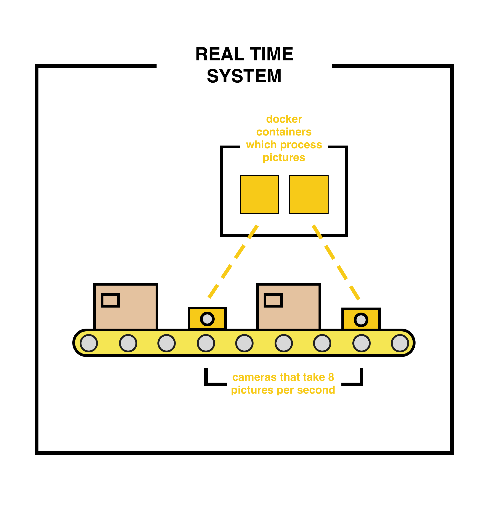
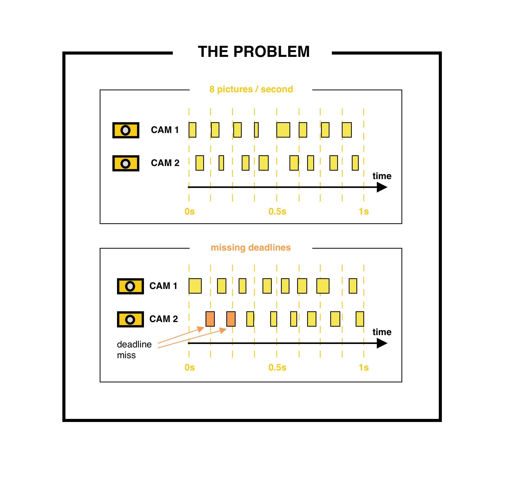

# Use cases 

This part of the repository contains use cases for the `orchestrator` and the `polena` real-time environment. A short description of the use cases follows below.

## Use cases 1 and 2 - Siemens Corporate Technology, USA

These first two use cases have been created together with Siemens to simulate typical application scenarios for RT-containers in industrial environments.

### Use case 1 - product quality control

In this fist example we consider image processing cameras o af production line which feed the container infrastructure with with an image flow. The images are then processed to look for product defects.

This would, in the case of two 8FPS cameras on one resource, produce a task scheduling schema like the following. Note that the processing time can not be considered constant as it widely depends on the complexity of the image and the amount of detectable objects. However, this also means that a scheduled resource can be over-subscribed.

As first guarantee we need the timely execution and delivery of results. With 8FPS we require indeed that the computation requires no longer than 125ms. If we further share computation resources with another camera, this time halves. You can see the trend here.

Ideally, `polenaRT` will create an environment where jitter and delays are reduced to a minimum. This is a test case where we can verify this.

The use case will simulate this scenario with 3 components. The generator, i.e., the camera, that produces our images at a settable speed. The distributor, which is in charge of load-balancing incoming frames, and the workers. The test will use 8FPS generation per running worker and run from 3 to 8 workers. Ideally the logs will confirm reactivity and determinism of our environment.

### Use case 2 - IoT and telemetry processing server
 

## Use case 3 - Codesys Control

In this scenario we consider the run-time software for IEC61131-3 compliant Soft-PLCs in bare or virtualized settings

*** WIP ***

## Use case 4 - Simatic vPLC

The fourth application considers the real-time environment around Siemens's vPLC package.

*** WIP ***

