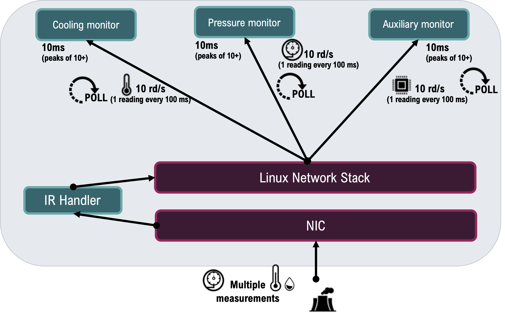
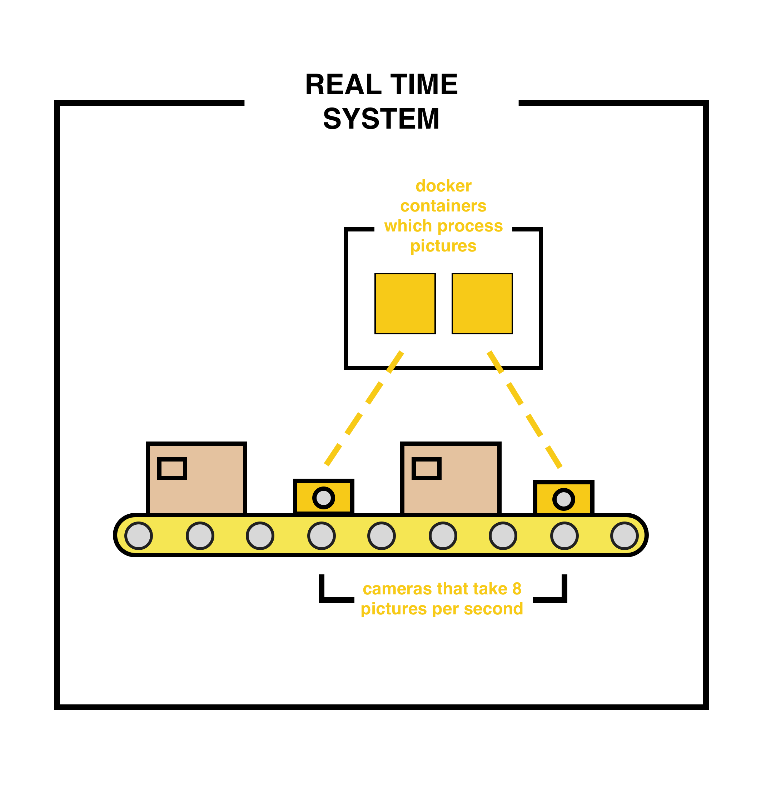
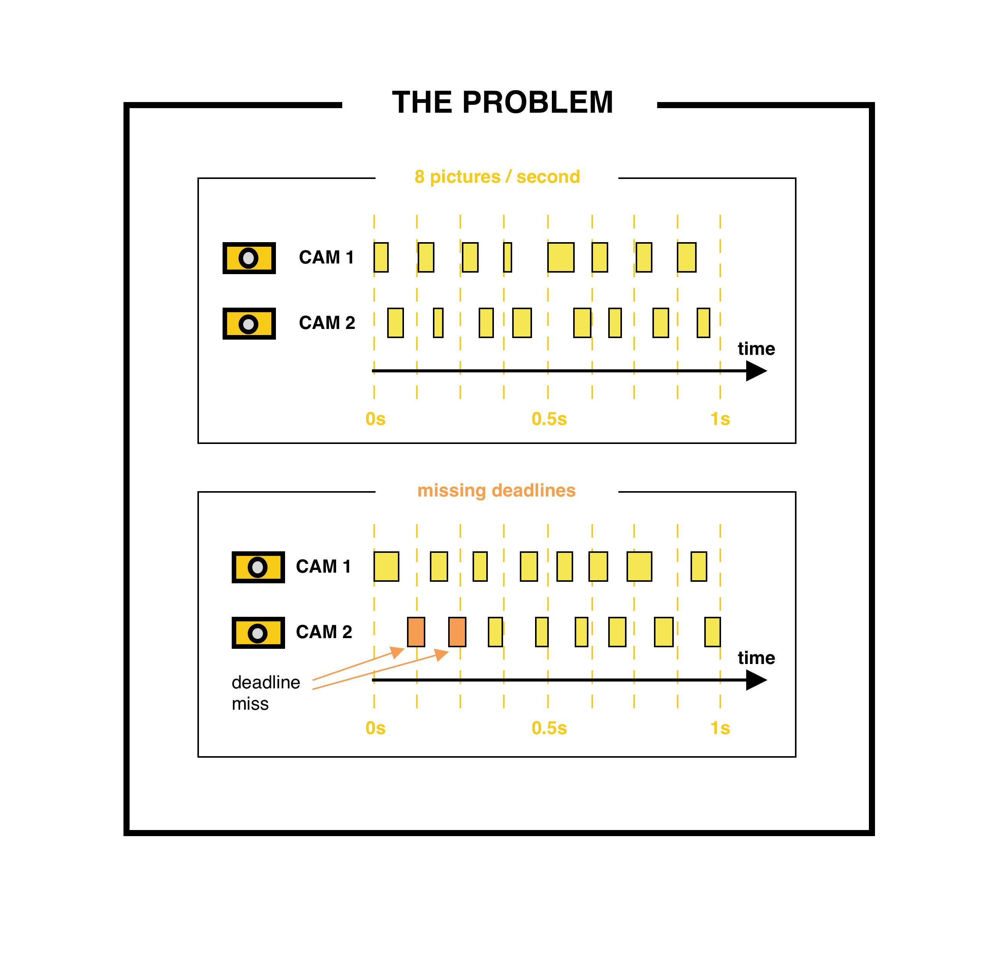
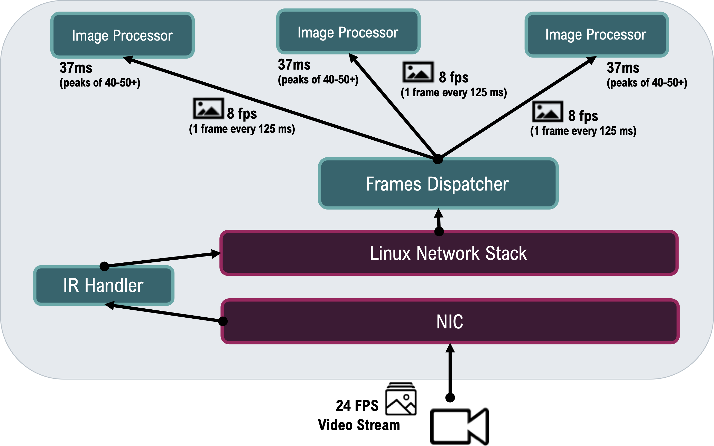
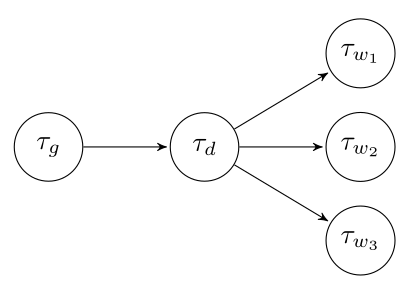
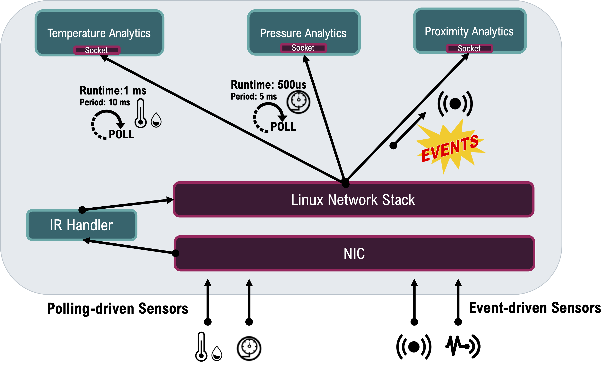
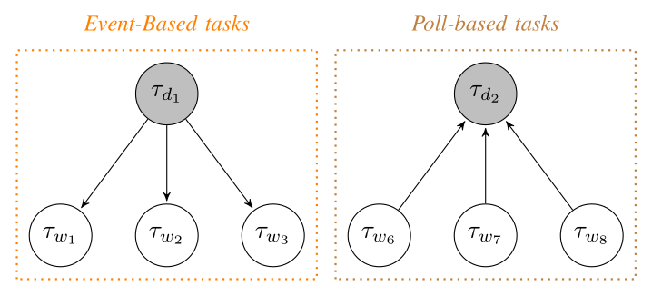

# Use cases 

This part of the repository contains use cases for the `orchestrator` and the `polena` real-time environment. The main focus of the code and examples is the setup and test run inside the polenaRT environment. Specific instructions for the `orchestrator` are not given as the latter is subject to constant change and adaptation.
I've included a short description of the use cases below.

## Use cases 1 and 2 - Siemens and University of California at Berkeley, USA

These first two use cases were created with Siemens to simulate typical application scenarios for real-time containers in industrial environments. 
The base case is represented in the image below. 
Imagine a remote plant that requires some remote supervision and telemetry acquisition. In such a case, the time constraints are rather minor. For example, we took the base case of 10 readings per second to monitor the plant, a 10ms computation to elaborate the data every 100ms, and are happy with sub-second reaction times to anomalies.

Although this seems like a simple quest, the problem is not reaching such terms but guaranteeing them, i.e., determinism. In the following two use cases, you will see data, samples, and configurations that match this base setup. We always want to double-check our base case first and then the system's performance with new configurations and tools. 

> [!NOTE]
> Both simulations are performed using the same *C++* binary and are thus located in the same folder. For usage, refer to the parameters and the run script `ucexec.sh`.

### Use case 1 - product quality control

In this first example, we consider image processing cameras on a production line, which feed the container infrastructure with an image flow. The images are then processed to look for product defects.

In the case of two 8FPS cameras on one resource, this would produce a task scheduling schema like the following. Note that the processing time can not be considered constant as it depends on the complexity of the image and the number of detectable objects. However, this also means that a scheduled resource can be oversubscribed.

As the first guarantee, we need the timely execution and delivery of results. With 8FPS, we require that the computation take no longer than 125ms. If we share computation resources with another camera, this time half. You can see the trend here.

Ideally, `polenaRT` will create an environment with minimal jitter and delays. This is a test case where we can verify this.

The use case will simulate this scenario with three components: the generator, i.e., the camera, which produces our images at a settable speed; the distributor, which is in charge of load-balancing incoming frames; and the workers. The test will use 8FPS generation per running worker and run from 3 to 8 workers. Ideally, the logs will confirm the reactivity and determinism of our environment.

*Task dependency graph*

### Use case 2 - IoT and telemetry processing server
 
The second use case describes a server that processes incoming data from sensors—a typical scenario for IoT. These sensors can be of two types: polling, i.e., the server asks the sensor regularly about new readings, and event-based. The latter can generate data inconsistently in size and time, making scheduling and prediction hard.

For this use case, we will use combined generator/distributor instances that regularly poll the worker tasks (deadline-driven) or use event-driven workers that generate random traffic.

*Task dependency graph*

The resulting graphs should thus have two shapes. For workers dealing with events, we are interested in seeing how quickly the data is fetched and elaborated. Polling workers, instead, are targeted on regular and constant execution. If correctly working, these workers will produce a graph with as many straight pillars as there are workers, displaying the exact respect of the deadlines and periodic execution without delay.

## Use cases 3 and 4 - Bi-Rex and the University of Bologna, Italy

The following two use cases focus on industrial automation and motion control. These environments are governed by PLCs—or Programmable Logic Controllers—that execute code using a runtime written in a domain-specific language. Both use cases will determine whether and how well the migration to virtualization and shared multi-tenant systems might perform for these real-time critical devices.

### Use case 3 - Codesys Control

In this first scenario, we consider the run-time software for CoDeSys' IEC61131-3 compliant Soft-PLCs in bare-metal or virtualized settings. The _Control SL for Linux_ software already runs as a soft real-time solution on bare metal systems. This test will also compare it to the newly introduced virtualization-optimized vPLC _Virtual Control SL_. 

*** WIP ***

### Use case 4 - Simatic vPLC

The fourth application considers the real-time environment around Siemens's vPLC package.

*** WIP ***

